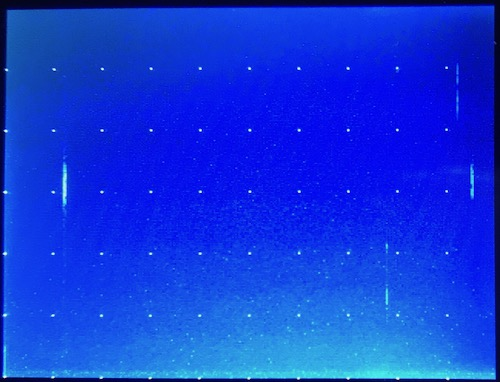

## RFM69 as Spectrum Analyser

This code produces a real-time [867.7-868.9] MHz spectrum "waterfall" display:

Colours are mapped from black (min) => blue => yellow => red => white (max).  
The display scrolls smoothly and continuously from right to left, with a  
horizontal marker every ≈ 420 ms, and a vertical marker every ≈ 200 KHz.  
In other words: the screen shows approximately 4 seconds x 1200 KHz.

### Hardware

Components used for this project:

* HyTiny - https://www.hotmcu.com/x-p-222.html
* 3.2" LCD - https://www.hotmcu.com/x-p-121.html
* RFM69 - http://www.hoperf.com/rf\_transceiver/modules/RFM69CW.html

LCD connections, using the pins on the HyTiny's FPC-12 connector and flat cable:

* MOSI = PB5
* MISO = PB4
* SCLK = PB3
* NSEL = PB0

RFM69 connections, using the standard SPI1 pins:

* MOSI = PA7
* MISO = PA6
* SCLK = PA5
* NSEL = PA4

Other pins can be assigned by adjusting the source code.

### Compiling and uploading

This project is set up for [PlatformIO](https://platformio.org) as toolchain:

* open this project in a supported IDE or do `cd examples/waterfall/`
* adjust `platformio.ini` as needed, in particular the upload port
* then build and upload, e.g. `pio run -t upload` from the command line

Found a bug? Please post on [GitHub](https://github.com/jeelabs/jeeh/issues).
